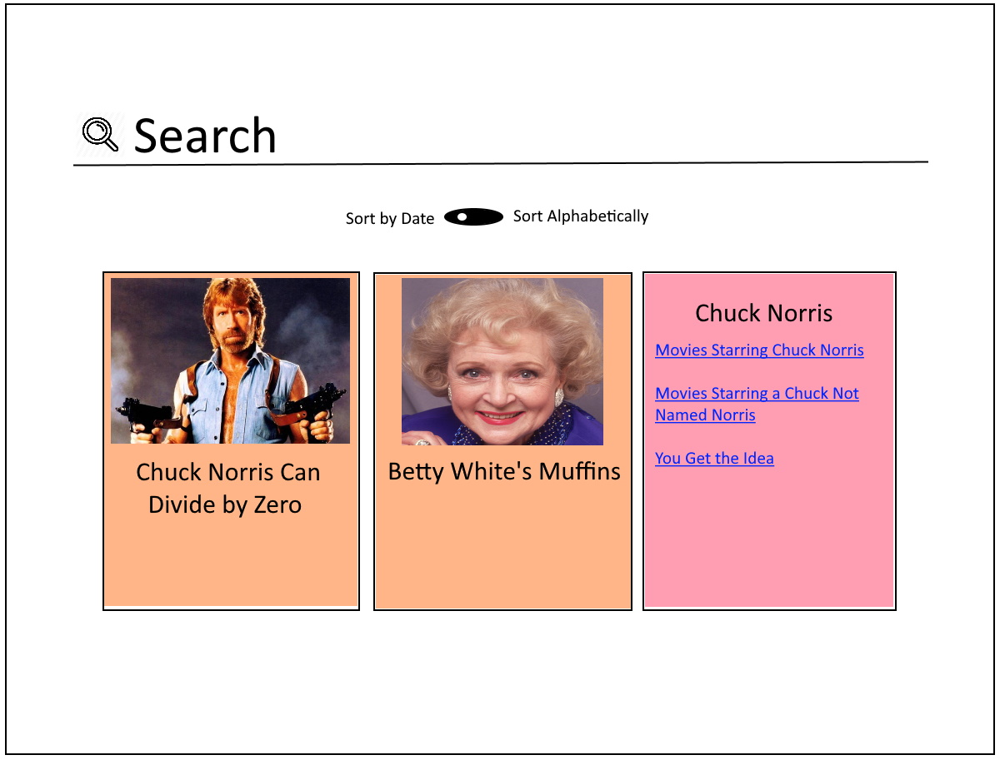

# Creating Components

I don't want you to have to barf again, but this is super easy too.

## Add [Angular Material]() for Designing Components

```
ng add @angular/material
```

## Add Layout Component for Encapsulating the UI

The layout component will be the main component for the entire screen and will contain sub-components for the search and entry list, each of which will contain it's own subcomponents. Let's start with the module:

```
ng generate module layout
```
or
```
ng g m layout
```
Then when we generate our layout component into the layout directory, the CLI will automatically declare our new component in the module for us:
```
ng generate component layout
```
or 
```
ng g c layout
```
...will result in the following write to our layout module:
```
declarations: [LayoutComponent]
```
## Overall Design of the Layout

The vision is pretty simple: a search bar and a list of tiles with a detailed data preview in each. Much like the following mockup:



I see three sub-components within Layout:
1. Search box
2. Sort selection
3. Tile Grid

Tile Grid also contains an array of tile sub-components.

So our hierarchy looks like so:

* App
* * Layout
* * * Search
* * * Sort
* * * Tile Grid 
* * * * Tile

Now let's create these sub-components and corresponding modules. For the tiles, let's call that module `results` and declare the tile grid and tile components inside:

```
ng generate module search
ng generate component search

ng generate module sort
ng generate component sort

ng generate module results
ng generate component results/tile-grid
ng generate component results/tile
```

Next, let's import these feature modules into the layout module:

```
imports: [
    CommonModule,
    SearchModule,
    SortModule,
    ResultsModule
]
```

## Awesome! Scaffold complete, so let's put some stuff in there...

### _SearchComponent_

The search component can begin as just an input FormControl:
```
export class SearchComponent implements OnInit {
	searchControl = new FormControl('');

	constructor() { }

	ngOnInit(): void {
	}

}
```
```
<mat-form-field>
	<input matInput
		type="text" 
		[formControl]="searchControl">
</mat-form-field>
```

...but in order to use FormControl, and the Angular Material MatFormField and MatInput components, we need to import the proper modules into SearchModule:
```
imports: [
    CommonModule,
    ReactiveFormsModule,
    MatFormFieldModule,
    MatInputModule
]
```

### _SortComponent_

The sort component will be an Angular Material [button toggle](https://material.angular.io/components/button-toggle/overview), so import that into SortModule:
```
imports: [
    CommonModule,
    MatButtonToggleModule
]
```

Let's go ahead and create an enumeration to represent our two sort types:
```
ng g enum sort/sort-type
```
```
export enum SortType {
	Chronological = 'chronological',
	Alphabetical = 'alphabetical'
}
```

The two button toggles within the group represent the two sort types:
```
<mat-button-toggle-group>
	<mat-button-toggle value="sortTypes.Chronological">
		Date
	</mat-button-toggle>
	<mat-button-toggle value="sortTypes.Alphabetical">
		A-Z
	</mat-button-toggle>
</mat-button-toggle-group>
```

Objectify the SortType enum for use in the template by creating a class field for sort types:
```
export class SortComponent implements OnInit {
	sortTypes = SortType;

	constructor() { }

	ngOnInit(): void {
	}
}
```

### _TileGridComponent (coming soon)_

